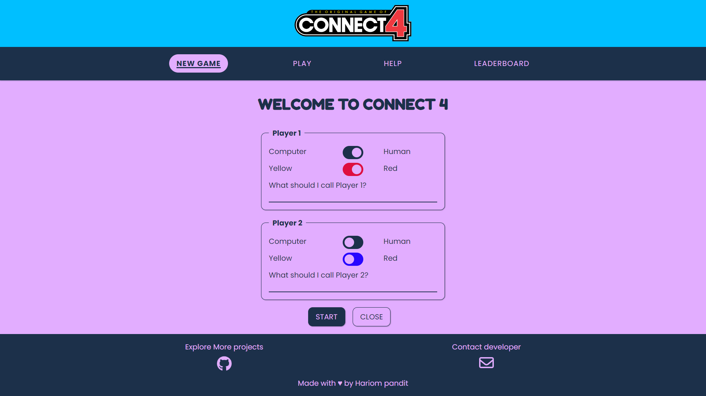

# Connect Four Web Game
[Connect 4 Gamme](https://hari7261.github.io/Connect-4-Game/) - click here to play game .

A classic two-player strategy game implemented as a web application. Play against the computer or challenge a friend to Connect Four!

## Table of Contents
- [Introduction](#introduction)
- [Features](#features)
- [Controls](#controls)
- [Important Code](#important-code)
- [How to Use](#how-to-use)
- [Contributing](#contributing)
- [License](#license)

## Introduction

This web application hosts a classic two-player strategy game called Connect Four. Developed by Sejung Kwak, it provides an engaging experience for users to play the game either against the computer or against a friend.

## Features

- **Responsive Design:** The web application is designed to be responsive, ensuring an optimal gaming experience on various devices.
- **Gameplay Options:** Play against the computer with adjustable difficulty or challenge a friend in a local two-player mode.
- **Leaderboard:** Track your performance with a local storage-based leaderboard that showcases the top 5 players.
- **Sound Effects:** Enjoy interactive sound effects during gameplay with the option to toggle them on or off.
- **Help Section:** Access a comprehensive help section providing information about the game's objective, rules, keyboard controls, points system, and leaderboard.

## Controls

- **Mouse Controls:**
  - Click on the desired column to drop a disc during gameplay.
- **Keyboard Controls:**
  - **Left Arrow:** Move the colored disc to the left.
  - **Right Arrow:** Move the colored disc to the right.
  - **Down Arrow:** Drop the colored disc in the targeted column.

## Technologies Used

- HTML5
- CSS3
- JavaScript (ES6)

## How to Play

1. Open the website and navigate to the "New Game" section.
2. Configure player settings (type, color, name).
3. Click "Start" to begin the game.
4. Take turns dropping discs into the grid.
5. Connect four discs vertically, horizontally, or diagonally to win.

## Controls

- Use the mouse to interact with the game.
- Arrow keys for keyboard navigation.

## Screenshots


 <!-- Replace with your screenshot link -->
*Screenshot 1 of game*


 <!-- Replace with your screenshot link -->
*Screenshott 2 of game*

1. Clone the repository:


## git clone https://github.com/hari7261/Connect-4-Game.git\


## Important Code

### Favicon and Stylesheet Linking

```html
<!-- Favicon -->
<link rel="apple-touch-icon" sizes="180x180" href="assets/images/favicon/apple-touch-icon.png" />
<link rel="icon" type="image/png" sizes="32x32" href="assets/images/favicon/favicon-32x32.png" />
<link rel="icon" type="image/png" sizes="16x16" href="assets/images/favicon/favicon-16x16.png" />
<link rel="shortcut icon" href="assets/images/favicon/favicon.ico" type="image/x-icon">

<!-- Link to the CSS file -->
<link rel="stylesheet" href="assets/css/style.css">
